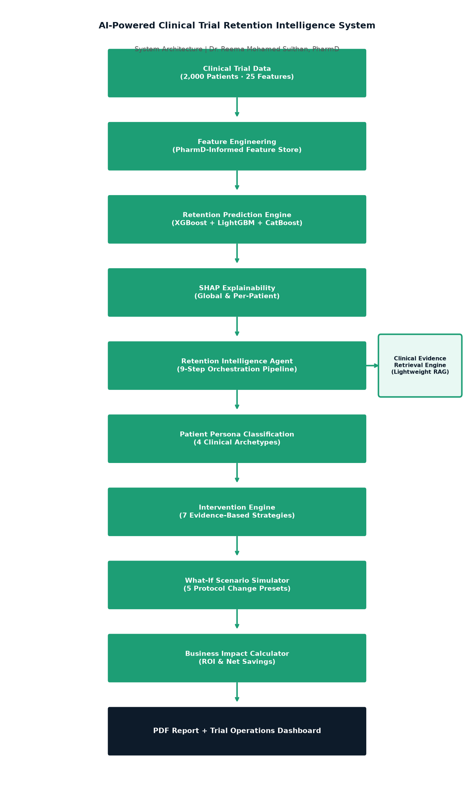

# AI-Powered Clinical Trial Retention Intelligence System


---

> ⚠️ **Disclaimer:** This project is for educational and portfolio demonstration purposes only.
> It does not constitute clinical advice and should not be used for participant care decisions.

---

## Live Demo

**[Launch App →](https://ai-powered-clinical-trial-retention-intelligence-eucpnx2cs9doz.streamlit.app)**

Try the four built-in demo profiles (High-Risk, Rural, Polypharmacy, Low-Risk) to see full end-to-end analysis and downloadable PDF reports without entering any data.

---

## The Clinical Problem

Clinical trial attrition remains a major industry challenge, with dropout rates of **20–30%** causing delays, cost overruns, and compromised trial integrity *(FDA, 2012; Getz KA et al., Ther Innov Regul Sci, 2016)*.

Participant replacement costs an estimated **$15,000–$25,000 per person**, including rescreening, re-enrolment, additional monitoring, and regulatory burden. Existing retention strategies are largely reactive — triggered after dropout occurs. AI-driven early prediction enables sponsors to deploy targeted, evidence-based interventions *before* a participant disengages.

---

## System Architecture



---

## Core Capabilities

| Capability | Description |
|-----------|-------------|
| **PREDICT** | XGBoost classifier identifies per-participant dropout risk with calibrated probability |
| **EXPLAIN** | SHAP TreeExplainer surfaces why each participant is at risk, in plain English |
| **INTERVENE** | 7 evidence-based intervention strategies matched to participant risk profile |
| **JUSTIFY** | Clinical Evidence Retrieval Engine cites FDA, ICH E6(R2), and peer-reviewed literature |
| **SIMULATE** | What-If Scenario Simulator models the impact of protocol changes on dropout risk |
| **CALCULATE** | Business Impact Calculator quantifies ROI of each intervention |
| **REPORT** | Downloadable 2-page PDF report for trial sponsors — executive-ready |

---

## Screenshots

### Participant Risk Assessment
*(Add screenshot of the main dashboard analysis tab here)*

### Trial Operations Dashboard
*(Add screenshot of the Trial Operations tab here)*

### PDF Report — Page 1
*(Add screenshot of the PDF report Page 1 here)*

### PDF Report — Page 2
*(Add screenshot of the PDF report Page 2 here)*

---

## PharmD Clinical Insight

As a PharmD-trained clinical data scientist, I recognise that clinical trial dropout is not a single-cause phenomenon. This system encodes the multi-dimensional burden of trial participation — pharmacological, logistical, psychosocial, and protocol-driven — as clinically informed features.

Three of the most actionable insights from this system:

1. **Week-2 side effect severity** is the dominant dropout predictor. Proactive pharmacovigilance contact at this window is both low-cost and high-impact *(ICH E6(R2), 2016)*.
2. **Distance without transportation** creates a hard logistical barrier independent of clinical profile. Transportation reimbursement is estimated to provide moderate risk reduction at low cost *(FDA, 2012)*.
3. **Protocol complexity** amplifies visit burden. ICH E6(R2)'s principle of proportionate monitoring supports eliminating non-critical assessments to reduce participant fatigue *(Getz KA et al., 2016)*.

**Key References:**
- FDA (2012). *Guidance for Industry: Patient Retention in Clinical Trials.* U.S. Department of Health and Human Services.
- ICH E6(R2). *Good Clinical Practice: Integrated Addendum to ICH E6(R1).* (2016).
- Getz KA et al. (2016). Measuring the incidence, causes and repercussions of protocol amendments. *Ther Innov Regul Sci*, 50(4), 435–441.

---

## Model Results

| Model | AUC | F1 | Recall | Brier Score |
|-------|-----|----|--------|-------------|
| **Logistic Regression ⭐** | **0.694** | **0.531** | **0.779** | **0.216** |
| Random Forest | 0.668 | 0.435 | 0.442 | 0.200 |
| XGBoost (Optuna-tuned) | 0.640 | 0.429 | 0.411 | 0.243 |
| LightGBM | 0.660 | 0.387 | 0.316 | 0.219 |
| CatBoost | 0.663 | 0.443 | 0.432 | 0.205 |

*Logistic Regression achieved highest recall (0.78) on this synthetic dataset. SHAP explanations use XGBoost (saved as model_v1.pkl) for tree-based attribution.*

*Recall is prioritised: in clinical retention, missing a future dropout (false negative) is more costly than an unnecessary intervention (false positive).*

---

## Key Finding

Week-2 side effect severity is the single strongest predictor of clinical trial dropout in this modelled population, with a SHAP contribution approximately **3× larger** than the next strongest factor (logistic friction score). This aligns with the pharmacovigilance principle that early adverse events, if unmanaged, become primary discontinuation triggers.

---

## Business Impact (Modelled Estimates)

> All figures are modelled estimates using synthetic data. Not guaranteed outcomes.

| Scenario | Estimated Value |
|----------|----------------|
| Participant replacement cost | ~$18,000 per participant |
| High-risk participants identified (600 pts, 35% high-risk) | ~210 participants |
| Estimated dropouts preventable (model recall × 60% success rate) | ~95 participants |
| Potential total savings | ~$1.7M |
| Total intervention cost | ~$137K |
| Estimated net benefit | ~$1.6M |

---

## System Components

| Module | File | Purpose |
|--------|------|---------|
| Data Generator | `src/data_generator.py` | Generates 2,000 synthetic participant records |
| Feature Engineering | `src/feature_engineering.py` | PharmD-informed composite features |
| Validator | `src/validator.py` | Pre-model data quality checks |
| Model Pipeline | `src/model.py` | 5 classifiers, Optuna tuning, survival analysis |
| SHAP Explainer | `src/explainer.py` | Global and per-participant SHAP explanations |
| Intervention Engine | `src/intervention_engine.py` | Evidence-based intervention recommendations |
| Business Impact | `src/business_impact.py` | ROI and net savings calculations |
| Clinical Evidence Retrieval | `src/evidence_retrieval.py` | Lightweight RAG citation engine |
| Persona Classifier | `src/personas.py` | 4 clinical participant archetypes |
| Scenario Simulator | `src/scenario_simulator.py` | What-if protocol change modelling |
| Retention Intelligence Agent | `src/agent.py` | 9-step orchestration pipeline |
| Report Generator | `src/report_generator.py` | 2-page executive PDF report |

---

## How to Run Locally

### 1. Clone and install
```bash
git clone https://github.com/reemahussain-pharmd/AI-Powered-Clinical-Trial-Retention-Intelligence.git
cd AI-Powered-Clinical-Trial-Retention-Intelligence
pip install -r requirements.txt
```

### 2. Generate data and train models
```bash
python src/data_generator.py
python src/model.py
python src/explainer.py
python src/generate_architecture.py
python src/report_generator.py
```

### 3. Launch the Streamlit app
```bash
streamlit run app.py
```

---

## Limitations

- Synthetic data — not derived from real sponsor datasets
- Intervention estimates are modelled, not clinically validated
- Proof of concept only — demonstrates analytical and PharmD-informed AI capability

---

## Author

**Dr. Reema Mohamed Sulthan, PharmD**
Clinical Data Scientist | Certified AI Expert

📧 reemahussain2097@gmail.com
🔗 [github.com/reemahussain-pharmd](https://github.com/reemahussain-pharmd)
